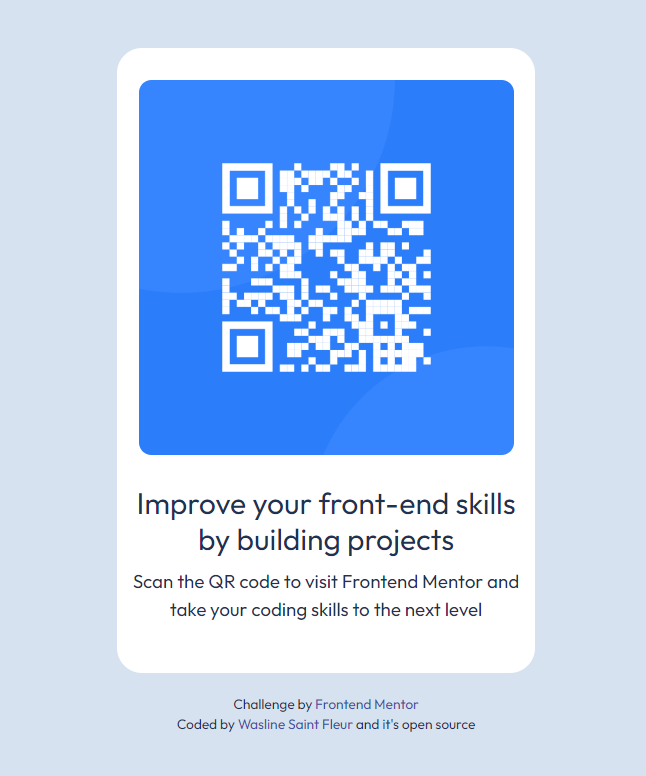

# Frontend Mentor - QR code component solution

This is a solution to the [QR code component challenge on Frontend Mentor](https://www.frontendmentor.io/challenges/qr-code-component-iux_sIO_H). Frontend Mentor challenges help you improve your coding skills by building realistic projects.

## Table of contents

- [Overview](#overview)
  - [Screenshot](#screenshot)
  - [Links](#links)
- [My process](#my-process)
  - [Built with](#built-with)
  - [What I learned](#what-i-learned)
  - [Continued development](#continued-development)
- [Author](#author)

## Overview

### Screenshot



### Links

- Solution URL: [My github link](https://github.com/Wasline/QR)
- Live Site URL: [Add live site URL here](https://63717c89075a5f27b8d408e4--adorable-faloodeh-6a9aa7.netlify.app/)

## My process

### Built with

- Semantic HTML5 markup
- CSS custom properties
- Flexbox
- CSS Grid

### What I learned

I learned that white-space: pre-line equivalents to </br>

```css
.attribution {
  font-size: 11px;
  text-align: center;
  white-space: pre-line;
}
```

### Continued development

I need to practice more @media screen and (max-width: 700px), and flexbox.

## Author

- Website - [Wasline Saint Fleur](https://www.waslinesaintfleur.com)
- Frontend Mentor - [@Wasline](https://www.frontendmentor.io/profile/Wasline)
- Twitter - [@sfwawa](https://www.twitter.com/sfwawa)